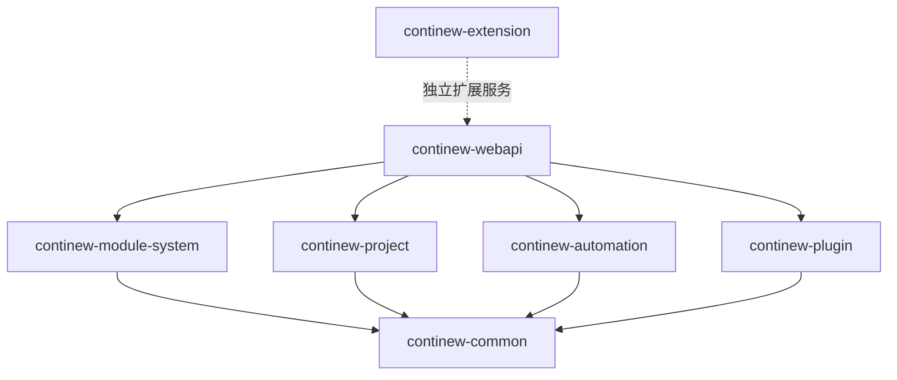
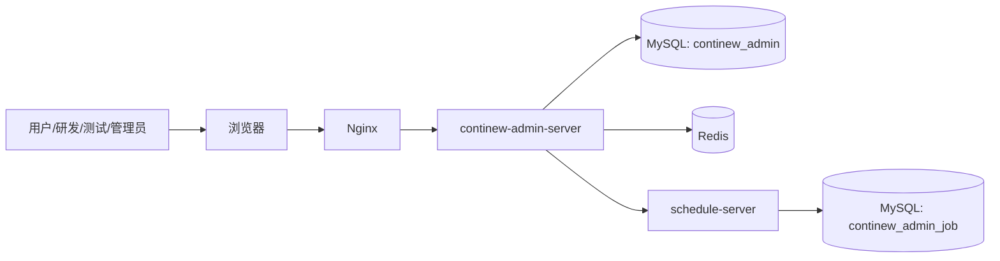
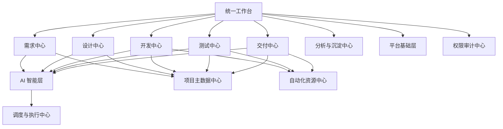
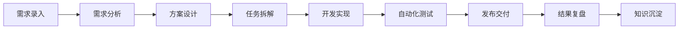
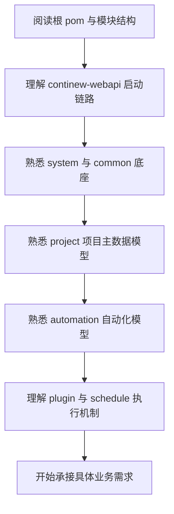

# SakurA Admin 老项目重构与 AI 自动化研发平台建设方案

## 1. 方案背景

当前方案的出发点，不是单纯替换老系统技术栈，而是解决老项目在持续演进过程中暴露出来的根本问题：

- 老项目架构耦合严重，新增需求改动范围大
- 基础能力分散，账号、权限、通知、日志、文件、配置等缺少统一底座
- 自动化能力依赖脚本和人工，缺少平台化沉淀
- 项目、环境、版本、服务器、数据库等关键信息分散，难以管理
- AI 工具无法嵌入业务流程，只能作为外围辅助
- 研发流程缺少统一入口，需求、设计、开发、测试、交付之间割裂

因此，本次重构的目标不是“重写旧系统”，而是建设一套可长期演进的平台底座：

**以当前 `SakurA Admin` 架构为核心，承接老项目能力，并逐步演进为 AI 自动化研发平台。**

## 2. 方案目标

## 2.1 总体目标

建设一套统一、可扩展、可持续演进的平台，覆盖：

- 需求管理
- 设计协同
- 开发协同
- 自动化测试
- 发布交付
- 知识沉淀
- AI 辅助能力

## 2.2 短期目标

以当前项目为基础完成老系统重构一期：

- 统一账号、权限、菜单、日志、文件、通知等平台底座
- 统一项目、版本、环境、服务器、数据库等主数据管理
- 统一自动化资源、节点、Jenkins、浏览器、UI 场景管理
- 建立任务调度与执行中心
- 支撑后续 AI 与自动化能力扩展

## 2.3 中长期目标

在一期底座稳定后，逐步建设：

- 需求中心
- 设计中心
- 开发协同中心
- 测试中心
- 交付中心
- AI 助手与智能编排层
- 效能分析与知识沉淀中心

## 3. 为什么选当前项目作为重构底座

## 3.1 当前项目具备成熟后台基础设施

当前仓库并不是空白框架，而是建立在 `ContiNew Admin` 成熟体系上的多模块工程，已经具备：

- 系统管理模块
- 公共能力模块
- 插件扩展模块
- 调度扩展服务
- Docker 部署基础
- 统一认证鉴权
- 统一日志和响应处理
- 配置化与模块化结构

这使得团队能够把重点放到“业务平台建设”，而不是继续重复搭建基础设施。

## 3.2 当前仓库已经具备关键业务基础

从代码看，当前项目已经有两个非常重要的业务中心：

### 项目管理中心 `continew-project`

已包含：

- 项目配置
- 项目版本配置
- 项目模块配置
- 项目环境配置
- 项目服务器配置
- 项目数据库配置

这部分天然适合作为研发流程中的“项目主数据中心”。

### 自动化管理中心 `continew-automation`

已包含：

- 自动化项目配置
- 自动化环境配置
- Jenkins 配置
- 节点配置
- 浏览器配置
- UI 自动化场景、用例、步骤管理

这部分天然适合作为研发流程中的“自动化资源与测试资产中心”。

## 3.3 当前架构适合渐进式重构

采用当前架构有一个关键优势：

- 不需要一次性推翻老系统
- 可按模块逐步迁移
- 可先统一底座，再逐步替换业务能力
- 可先承接老流程，再逐步引入 AI 与自动化

这比一次性大重构的风险更低，更容易获得管理层支持。

## 4. 当前项目架构分析

## 4.1 模块结构

当前项目整体为多模块单体架构，模块包括：

- `continew-webapi`
- `continew-module-system`
- `continew-common`
- `continew-plugin`
- `continew-extension`
- `continew-project`
- `continew-automation`

### 模块依赖图

## 4.2 当前部署架构

## 4.3 当前技术基线

当前项目主要技术基线如下：

- Java 17
- Spring Boot 3.3.x
- Undertow
- Sa-Token + JWT
- MyBatis Plus
- Redis + Redisson + JetCache
- MySQL 8
- Liquibase
- Knife4j / OpenAPI
- Snail Job
- X File Storage
- ContiNew Starter CRUD 扩展

这套技术组合非常适合作为企业内部平台型项目的后端底座。

## 5. 目标平台定位

建议将项目未来正式命名和定位为：

**AI 自动化研发平台**

平台服务对象包括：

- 产品经理
- 研发经理
- 开发人员
- 测试人员
- 运维/交付人员
- 管理层

平台目标不是替代所有研发工具，而是把核心流程串起来。

## 6. 目标平台蓝图

## 6.1 全景蓝图

## 6.2 与当前项目映射关系

| 目标平台能力 | 当前项目支撑情况 | 后续动作 |
| --- | --- | --- |
| 权限审计中心 | 已具备系统管理能力 | 增强审计与过程留痕 |
| 项目主数据中心 | 已具备 `continew-project` | 扩展项目域模型 |
| 自动化资源中心 | 已具备 `continew-automation` | 补齐执行编排与报告 |
| 调度与执行中心 | 已具备调度插件和调度服务 | 打通统一执行链路 |
| 开放接口能力 | 已具备 `continew-plugin-open` | 用于系统集成与 AI 调用 |
| 代码辅助能力 | 已具备代码生成插件 | 扩展为研发效率工具 |
| AI 智能层 | 尚未成型 | 作为二期重点建设 |

## 7. 平台能力规划

## 7.1 一期建设目标

一期目标是“先把平台底座站稳”。

### 核心建设内容

- 老项目能力梳理与模块拆分
- 统一权限、用户、菜单、日志、文件、通知、配置
- 建立项目主数据中心
- 建立自动化资源中心
- 统一任务调度与执行机制
- 提供开放接口和标准化集成能力

### 一期成果

- 一个可稳定运行的平台底座
- 一套统一的后台管理体系
- 一套统一的项目/环境/版本/模块数据模型
- 一套统一的自动化配置管理体系

## 7.2 二期建设目标

二期目标是“打通研发流程链路”。

### 核心建设内容

- 建设需求中心
- 建设设计协同中心
- 建设开发协同中心
- 建设测试中心
- 建设交付中心
- 建立流程状态流转
- 建立研发过程可视化

### 二期成果

- 从需求到交付形成统一工作流
- 项目与研发流程真正关联起来
- 流程状态、责任人、进度、风险可视化

## 7.3 三期建设目标

三期目标是“引入 AI，形成智能研发平台”。

### 核心建设内容

- AI 需求分析助手
- AI 设计输出助手
- AI 测试用例生成助手
- AI 接口/脚本生成助手
- AI 执行编排建议
- AI 文档沉淀与知识检索

### 三期成果

- AI 不再是外挂工具，而是平台内能力
- 研发流程从“人驱动”走向“人机协同驱动”
- 平台形成持续复用的知识与资产

## 8. 平台业务域设计建议

建议将平台划分为以下核心业务域：

### 8.1 平台基础域

负责：

- 用户
- 角色
- 权限
- 菜单
- 字典
- 通知
- 文件
- 系统配置
- 日志与审计

当前主要由：

- `continew-module-system`
- `continew-common`

承载。

### 8.2 项目域

负责：

- 项目
- 版本
- 模块
- 环境
- 服务器
- 数据库

当前主要由：

- `continew-project`

承载。

### 8.3 自动化域

负责：

- 自动化项目配置
- 执行节点
- Jenkins 配置
- 浏览器配置
- UI 场景
- 用例
- 步骤
- 执行资源

当前主要由：

- `continew-automation`

承载。

### 8.4 执行与调度域

负责：

- 任务执行
- 定时调度
- 重试
- 日志记录
- 统一编排

当前主要由：

- `continew-plugin-schedule`
- `continew-extension-schedule-server`

承载。

### 8.5 开放与集成域

负责：

- AK/SK
- 开放接口
- 第三方调用
- 系统集成
- AI 外部调用接入

当前主要由：

- `continew-plugin-open`

承载。

### 8.6 AI 智能域

负责：

- 模型接入
- Prompt 模板
- 任务编排
- 智能建议
- 文档生成
- 代码生成
- 知识检索

该域当前尚未独立成模块，建议作为二期/三期重点新增业务域。

## 9. 典型业务流程设计

## 9.1 需求到交付的理想闭环

## 9.2 AI 在流程中的切入点

| 流程阶段 | AI 能力切入建议 |
| --- | --- |
| 需求 | 自动摘要、需求拆解、影响分析 |
| 设计 | 页面草案、接口草案、数据模型建议 |
| 开发 | 代码生成、接口模板生成、脚本辅助 |
| 测试 | 用例生成、测试数据生成、回归建议 |
| 交付 | 发布检查项、变更摘要、交付清单 |
| 沉淀 | 文档归档、知识整理、相似问题检索 |

## 10. 采用当前架构后的实施路线

## 10.1 路线原则

- 先平台，后业务
- 先统一底座，后迁移功能
- 先承接存量，后引入智能化
- 先跑通关键流程，后补齐全景能力

## 10.2 分阶段实施路线图

### 阶段 0：准备期

目标：

- 梳理老项目功能清单
- 梳理数据模型与接口
- 梳理现有自动化脚本和工具链
- 明确哪些能力直接迁移，哪些能力重构优化

输出：

- 老项目能力地图
- 重构范围清单
- 模块归属表
- 数据迁移清单

### 阶段 1：平台底座落地

目标：

- 部署当前项目基础环境
- 建立统一认证与权限
- 建立统一项目主数据中心
- 建立统一自动化资源中心
- 跑通调度与执行能力

输出：

- 一期可用平台
- 主数据模型初版
- 自动化配置管理初版

### 阶段 2：老业务迁移

目标：

- 将老项目中核心业务逐步迁移到新平台
- 将老流程映射到项目、版本、环境、自动化模型中
- 逐步停用老系统重复能力

输出：

- 老系统核心业务迁移完成
- 关键流程在新平台中可用

### 阶段 3：AI 能力接入

目标：

- 引入 AI 助手能力
- 先在需求分析、测试生成、文档生成等低风险环节落地
- 再逐步扩展到开发协同和流程编排

输出：

- AI 助手一期能力可用
- 平台形成初步智能化协同能力

## 11. 开发接手路线图

对于新成员或新团队，建议按如下顺序接手项目：

### 接手建议

- 第 1 周：熟悉架构、环境搭建、跑通接口
- 第 2 周：熟悉权限模型和基础 CRUD 扩展
- 第 3 周：重点熟悉 `continew-project`
- 第 4 周：重点熟悉 `continew-automation`
- 第 5 周以后：开始承接业务迁移与新模块建设

## 12. 团队组织与职责建议

建议按平台建设方式组织分工：

### 平台底座组

负责：

- `continew-webapi`
- `continew-module-system`
- `continew-common`
- 权限、日志、配置、通知、文件、审计

### 项目域组

负责：

- `continew-project`
- 项目、版本、模块、环境、服务器、数据库模型

### 自动化域组

负责：

- `continew-automation`
- UI 场景、节点、浏览器、Jenkins、执行资源

### 基础设施与扩展组

负责：

- `continew-plugin`
- `continew-extension`
- 调度、开放接口、代码生成、部署体系

### AI 赋能组

负责：

- AI 模型接入
- Prompt 体系
- AI 工作流编排
- 知识库与语义检索

## 13. 风险分析与应对

## 13.1 风险一：老系统业务过于复杂

应对：

- 先做能力地图，不急于一次性迁移
- 按业务域分批次重构
- 重点优先迁移高频、高痛点、可标准化模块

## 13.2 风险二：项目边界持续扩张

应对：

- 在一期先控制范围
- 平台底座优先，业务扩展有节奏推进
- 避免在未稳定底座时同时做大规模 AI 能力建设

## 13.3 风险三：团队成员对新架构不熟悉

应对：

- 使用本文档和架构说明做统一培训
- 固化模块责任边界
- 固化命名规范与新功能落点规则

## 13.4 风险四：AI 目标过大导致方案失焦

应对：

- 先把 AI 定位为“平台增强能力”
- 先解决流程标准化和数据结构化
- 有了统一平台后再逐步引入 AI

## 14. 预期收益

## 14.1 技术收益

- 降低技术债
- 提高系统可维护性
- 提高模块复用率
- 降低后续需求变更成本

## 14.2 业务收益

- 项目、环境、版本等核心数据统一管理
- 自动化资产可积累、可复用、可追踪
- 发布与测试流程更标准

## 14.3 管理收益

- 研发过程更透明
- 责任边界更清晰
- 执行记录可审计
- 平台可逐步成为研发管理抓手

## 14.4 战略收益

- 形成企业自己的 AI 自动化研发平台底座
- 将一次重构投入转化为长期平台资产
- 为后续多项目复制提供标准架构

## 15. 建议的汇报口径

在对领导或老板汇报时，建议不要把重点放在技术名词上，而是放在业务价值和长期收益上。

推荐表达方式如下：

### 建议表达 1

当前不是简单替换老系统，而是借这个机会建立统一的平台底座，把分散的项目管理、自动化管理和执行能力统一起来，为未来 AI 融入研发流程打基础。

### 建议表达 2

如果继续在老项目上叠加功能，维护成本会持续上升；而采用当前架构重构，可以在短期解决系统治理问题，中期提升研发效率，长期形成公司的 AI 自动化研发平台资产。

### 建议表达 3

这不是一次性大爆炸重构，而是一条可渐进落地、风险可控、收益逐步释放的平台化路线。

## 16. 建议的决策结论

建议管理层批准以当前 `SakurA Admin` 架构作为老项目重构底座，按“三阶段路线”推进：

1. 平台底座建设
2. 老业务迁移与流程打通
3. AI 能力逐步接入

这是当前最平衡的方案，原因在于：

- 当前项目已经不是纯空架构
- 具备足够的平台基础能力
- 具备项目与自动化两个核心业务中心
- 具备调度、开放、代码生成等扩展能力
- 可以逐步演进为 AI 自动化研发平台

## 17. 参考资料

- ContiNew 官方站点：https://continew.top
- ContiNew Admin 项目介绍：https://continew.top/admin/guide/introduction.html
- ContiNew Admin 后端项目结构：https://continew.top/docs/admin/backend/structure.html
- ContiNew Admin 认证鉴权说明：https://continew.top/docs/admin/backend/auth.html
- ContiNew Admin 数据权限说明：https://continew.top/docs/admin/backend/data-permission.html

## 18. 本方案对应信息

- 项目仓库：`sakura-admin`
- 分析日期：`2026-04-20`
- 当前代码版本：`3.6.0-SNAPSHOT`
- 方案定位：老项目重构与 AI 自动化研发平台建设方案
