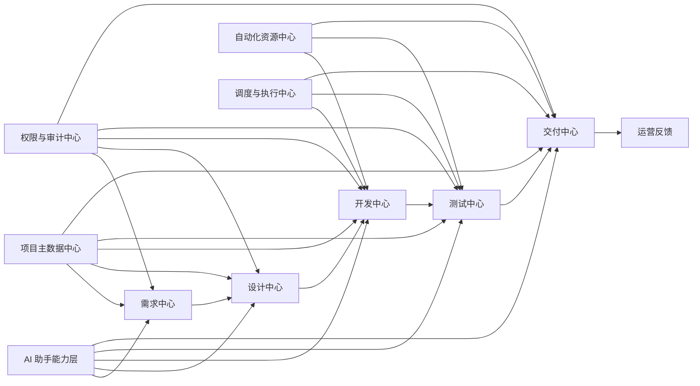
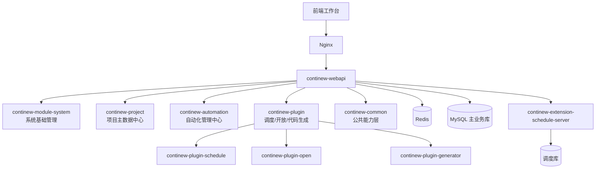
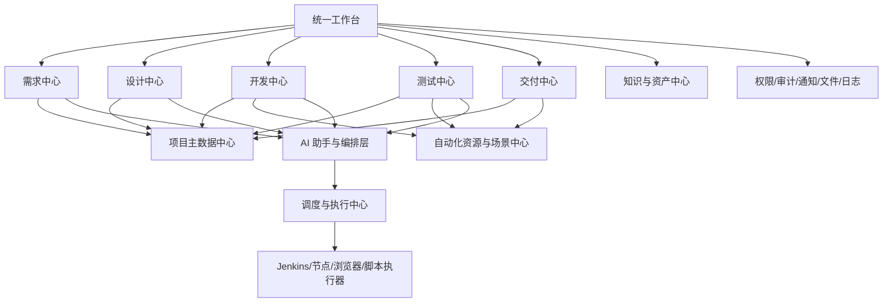

# SakurA Admin 重构立项汇报摘要

## 1. 一句话定位

`SakurA Admin` 不是单纯的后台管理系统，而是一个基于 `ContiNew Admin 3.6.0-SNAPSHOT` 底座演进的企业级 AI 自动化研发平台基础架构，可作为老项目重构后的统一平台底座，逐步承接 `需求 - 设计 - 开发 - 测试 - 交付` 全流程协同。

## 2. 给领导的核心结论

当前老项目如果继续在原有架构上叠加功能，问题通常会持续放大：

- 业务耦合重，改一处牵一片
- 缺少统一账号、权限、配置、日志、通知、文件、调度等平台能力
- 自动化能力分散在脚本、Jenkins、人工流程中，难以沉淀
- 新成员上手慢，维护成本高，交付效率低
- AI 能力难以真正嵌入研发流程，只能停留在零散工具使用阶段

采用当前项目架构进行重构，有三个直接收益：

1. 先统一底座，再沉淀业务，降低后续每次开发的重复成本
2. 以项目管理和自动化管理为核心，逐步形成研发全流程平台
3. 为后续 AI 赋能预留稳定结构，不需要未来推倒重来

## 3. 为什么建议采用当前架构

### 3.1 不是从零开发，风险更低

当前项目已经具备成熟后台基础设施：

- 用户、角色、菜单、部门、字典、通知、文件、日志等标准能力
- Sa-Token 权限体系
- 统一响应、统一异常、统一日志
- Redis 缓存、MyBatis Plus、Liquibase、OpenAPI 文档
- Docker 化部署基础
- 调度中心与插件扩展机制

这意味着重构不是重新造轮子，而是在成熟底座上承接老项目能力。

### 3.2 当前仓库已经有业务雏形，不是纯框架

当前项目已沉淀出两条关键业务主线：

- `continew-project`：项目、环境、服务器、数据库、版本、模块等主数据管理
- `continew-automation`：自动化项目、节点、Jenkins、浏览器、UI 场景/用例/步骤管理

这两条主线非常适合继续扩展为 AI 自动化研发平台。

### 3.3 支撑 AI 平台演进的结构已经具备

平台未来要接入 AI，最怕的是：

- 没有统一项目上下文
- 没有标准化流程节点
- 没有统一任务编排
- 没有统一执行记录和审计链路

而当前架构已经具备这些演进前提：

- 项目主数据中心
- 自动化资源中心
- 调度中心
- 开放接口能力
- 代码生成能力
- 模块化扩展能力

## 4. 领导最关心的价值

### 4.1 成本价值

- 减少重复建设后台基础能力的成本
- 降低老项目后续维护和变更成本
- 降低人员流动带来的知识断层成本

### 4.2 效率价值

- 项目配置、环境配置、自动化配置集中管理
- 需求到交付过程逐步平台化、标准化
- 自动化资产可以沉淀复用，而不是一次性脚本

### 4.3 管理价值

- 研发过程可见
- 流程节点可追踪
- 执行过程可审计
- 结果可量化

### 4.4 战略价值

- 为 AI 接入研发流程提供统一平台入口
- 为后续工程效率提升打基础
- 避免未来因为架构落后再进行第二次大重构

## 5. 目标平台蓝图

建议将本项目定位为：

**AI 自动化研发平台**

覆盖研发全流程：

- 需求管理
- 设计协同
- 开发协同
- 测试自动化
- 发布交付
- 过程沉淀与数据分析

### 平台能力蓝图

## 6. 当前项目在蓝图中的位置

当前项目已经覆盖了平台底座中的关键部分：

- 权限与系统基础设施
- 项目主数据中心
- 自动化资源中心
- 调度与执行中心
- 开放接口能力

因此，当前项目最适合作为“平台底座一期”。

## 7. 架构图

### 7.1 当前可落地架构图

### 7.2 未来 AI 平台扩展架构图

## 8. 重构后的业务边界建议

### 一期重点

- 替换老项目中分散的系统管理能力
- 建立统一项目主数据中心
- 建立统一自动化资源中心
- 建立统一调度与执行基础

### 二期重点

- 建立需求、设计、开发、测试、交付五大业务中心
- 打通项目版本、模块、环境、用例、任务、发布流程
- 引入 AI 助手到需求分析、设计生成、代码协助、测试生成

### 三期重点

- 建立平台数据驾驶舱
- 建立知识库、经验库、规范库
- 建立自动化度量和效能分析体系

## 9. 对比老项目改造的优势

| 维度 | 老项目通常现状 | 采用当前架构后的状态 |
| --- | --- | --- |
| 系统能力 | 分散、重复建设 | 统一底座 |
| 权限体系 | 不统一 | 标准化 RBAC |
| 项目数据 | 散落在各模块 | 统一主数据中心 |
| 自动化能力 | 脚本化、碎片化 | 平台化沉淀 |
| 调度执行 | 依赖人工或独立工具 | 统一调度中心 |
| AI 接入 | 工具级尝试 | 平台级嵌入 |
| 维护成本 | 持续走高 | 可控下降 |
| 扩展能力 | 新需求改动大 | 模块化扩展 |

## 10. 推荐的立项表述

建议对领导直接表述为：

> 本次不是单纯做一次“技术重写”，而是借助当前已经具备基础能力的 `SakurA Admin` 架构，完成老项目的平台化重构。短期目标是统一项目管理、自动化管理和调度能力，中期目标是逐步覆盖需求、设计、开发、测试、交付全流程，长期目标是建设团队自己的 AI 自动化研发平台。

## 11. 投资回报逻辑

短期回报：

- 降低老项目继续演进的技术负债
- 提升系统稳定性和可维护性
- 缩短常规功能开发周期

中期回报：

- 自动化资产沉淀
- 测试与交付效率提升
- 研发流程可视化与标准化

长期回报：

- AI 能力真正融入研发全流程
- 团队形成自己的工程效率平台
- 平台成为业务持续迭代的长期资产

## 12. 结论

建议采用当前项目架构作为老项目重构底座，理由不是“技术新”，而是：

- 结构已经成熟
- 当前仓库已有业务基础
- 适合循序渐进承接老项目
- 能自然演进为 AI 自动化研发平台

从投入产出比来看，这是比继续在老架构上修补更合理的路径。
