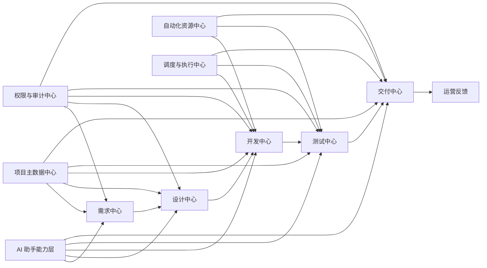
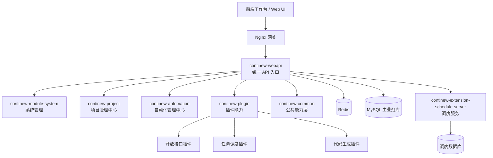
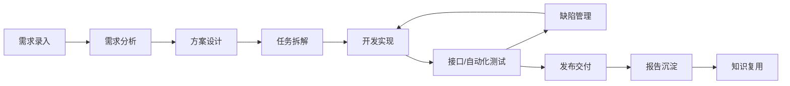
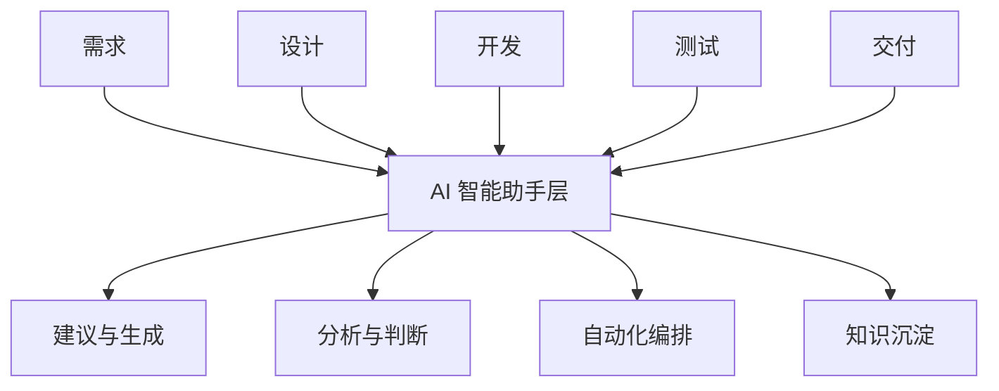
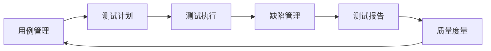
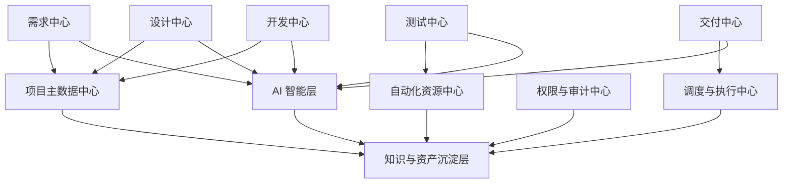
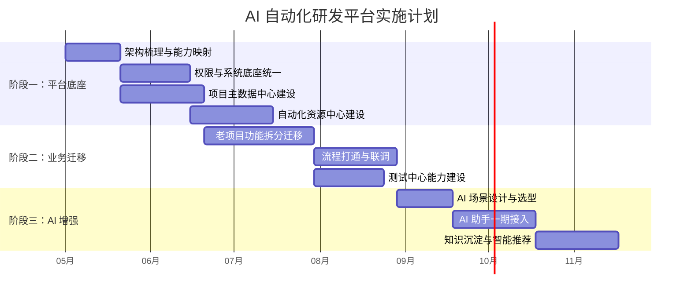

# 老项目重构与 AI 自动化研发平台建设方案

## 第 1 页｜项目背景与汇报结论

### 页面核心观点

- 当前老项目已经进入“维护成本持续上升、扩展效率持续下降”的阶段
- 本次建议不是简单技术重写，而是借重构机会统一平台底座
- 以 `SakurA Admin` 为基础，逐步建设 AI 自动化研发平台

### 页面正文

#### 当前主要问题

- 架构耦合高，改动影响范围大
- 基础能力分散，账号、权限、日志、文件、调度等未统一
- 自动化依赖脚本、Jenkins 和人工流程，难沉淀、难复制
- AI 能力无法真正进入研发流程，只能停留在工具级使用

#### 本次建议

- 以当前 `SakurA Admin` 作为老项目重构底座
- 先完成平台底座统一，再承接老业务迁移
- 逐步构建覆盖需求、设计、开发、测试、交付的 AI 自动化研发平台

#### 汇报结论

- 建议采用当前架构推进重构
- 短期解决治理与维护问题
- 中长期形成平台资产和 AI 研发能力

### 讲解话术

这次汇报的重点不是讨论要不要换一套新技术，而是希望解决老项目已经暴露出来的结构性问题。我们建议以当前已经具备基础能力的 `SakurA Admin` 架构为底座，完成老项目的平台化重构，并为后续 AI 自动化研发平台建设打基础。

---

## 第 2 页｜为什么老项目必须重构

### 页面核心观点

- 继续在老架构上修补，成本会越来越高
- 当前问题已经从“功能问题”演变成“平台能力问题”

### 页面正文

#### 现状痛点

- 业务耦合重，改一处牵一片
- 模块边界不清，重复逻辑较多
- 项目、版本、环境、服务器、数据库等关键信息分散
- 自动化能力缺少统一入口和资产沉淀
- 新成员接手成本高，知识依赖个人经验

#### 继续修补的风险

- 开发效率继续下降
- 维护风险持续放大
- 自动化投入无法形成长期资产
- AI 能力难以规模化落地

#### 重构的必要性

- 统一底座
- 统一主数据
- 统一自动化能力
- 统一流程链路

### 讲解话术

如果继续在老项目上做增量修补，短期看似快，长期会越来越贵。因为问题已经不是几个功能模块不好用，而是系统缺少统一平台能力。尤其未来要做 AI，如果没有统一项目上下文、流程节点和执行链路，AI 就只能停留在零散助手层面。

---

## 第 3 页｜为什么选当前架构作为重构底座

### 页面核心观点

- 当前项目不是空架构，而是已经具备平台底座与业务雏形
- 采用现有架构可降低重构风险、缩短落地周期

### 页面正文

#### 已具备的平台基础

- 用户、角色、菜单、权限、日志、文件、通知等系统能力
- Sa-Token 认证鉴权体系
- 统一响应、统一异常、统一日志
- Redis、MyBatis Plus、Liquibase、OpenAPI 文档
- Docker 化部署和调度扩展能力

#### 已具备的业务雏形

- `continew-project`
  - 项目、版本、模块、环境、服务器、数据库管理
- `continew-automation`
  - 自动化项目、节点、Jenkins、浏览器、UI 场景/用例/步骤管理

#### 结论

- 不是从零造平台
- 是在已有底座上承接老业务并向 AI 平台演进

### 讲解话术

我们建议采用当前架构，不是因为它“更新”，而是因为它已经具备很好的平台起点。一方面，后台通用能力已经比较完整；另一方面，项目管理和自动化管理两个核心业务中心也已经有雏形。这使得重构可以在低风险基础上推进，而不是从零开始。

---

## 第 4 页｜目标定位：AI 自动化研发平台

### 页面核心观点

- 重构后的目标不是另一个管理后台
- 而是一个贯通研发全流程的平台

### 页面正文

#### 平台定位

**AI 自动化研发平台**

#### 覆盖范围

- 需求管理
- 设计协同
- 开发协同
- 测试自动化
- 发布交付
- 过程沉淀与数据分析

#### 底层支撑能力

- 项目主数据中心
- 自动化资源中心
- 调度与执行中心
- 权限与审计中心
- AI 助手能力层

### Mermaid 图

### 讲解话术

我们的目标不是做另一个后台系统，而是构建一个覆盖需求、设计、开发、测试、交付全流程的平台。上层是业务流程中心，下层是项目主数据、自动化资源、调度执行和 AI 助手能力。未来每个研发节点都能在一个统一平台中沉淀和协同。

---

## 第 5 页｜当前架构总览

### 页面核心观点

- 当前项目已经具备实际可落地的技术与模块架构
- 适合作为现阶段重构底座

### 页面正文

#### 当前架构特点

- 单体应用 + 模块化工程
- 独立调度服务
- 统一 API 入口
- 插件化扩展能力

#### 当前已落地模块

- `continew-webapi`
- `continew-module-system`
- `continew-common`
- `continew-project`
- `continew-automation`
- `continew-plugin`
- `continew-extension`

### Mermaid 图

### 讲解话术

这是当前项目的真实可落地架构。它不是高成本的微服务拆分架构，而是更适合现阶段的平台化单体架构，兼顾开发效率、部署成本和后续扩展能力。对于当前重构阶段，这是更稳妥的选择。

---

## 第 6 页｜核心模块能力拆解

### 页面核心观点

- 当前项目已形成五类核心能力
- 可直接承接老项目重构与平台建设

### 页面正文

#### 系统基础管理

- 用户、角色、菜单、权限
- 日志、通知、文件、配置

#### 项目管理中心

- 项目配置
- 版本配置
- 模块配置
- 环境配置
- 服务器配置
- 数据库配置

#### 自动化管理中心

- 自动化项目
- Jenkins 配置
- 节点配置
- 浏览器配置
- UI 场景、用例、步骤

#### 调度与执行中心

- 定时调度
- 执行编排
- 执行日志
- 结果汇总

#### 开放与扩展中心

- 开放接口
- AK/SK
- 代码生成
- 外部系统集成
- 后续 AI 接入

### 讲解话术

这一页的重点是让管理层看到，当前项目不是只有技术底座，而是已经具备较完整的平台能力。尤其项目管理中心和自动化管理中心，是后续支撑研发流程和 AI 落地的两个关键业务核心。

---

## 第 7 页｜需求到交付的流程闭环

### 页面核心观点

- 平台建设的重点不是单点工具，而是全流程闭环

### 页面正文

#### 目标闭环

- 需求录入
- 方案设计
- 任务拆解
- 开发实现
- 测试验证
- 缺陷反馈
- 发布交付
- 结果沉淀

#### 平台承接点

- 需求与设计阶段：项目与模块归档
- 开发阶段：任务、接口、脚本、版本关联
- 测试阶段：场景、用例、步骤、资源统一管理
- 交付阶段：执行调度、报告输出、结果沉淀

### Mermaid 图

### 讲解话术

我们做这次重构，不是为了把原来的几个功能搬过来，而是为了把研发流程真正串起来。未来从需求到交付，每个节点都能够在平台上形成数据、过程和结果沉淀，从而让管理、协同和自动化都具备统一基础。

---

## 第 8 页｜AI 能力如何嵌入平台

### 页面核心观点

- AI 不作为独立外挂存在
- 而是作为流程增强能力嵌入研发全过程

### 页面正文

#### AI 切入点

- 需求：摘要、拆解、影响分析
- 设计：方案草案、接口草案、数据模型建议
- 开发：模板生成、脚本生成、代码辅助
- 测试：用例生成、数据生成、回归建议
- 交付：变更摘要、交付清单、报告总结
- 沉淀：知识归档、检索推荐、经验复用

#### 落地原则

- 先做低风险、高收益场景
- 先做辅助，再做编排
- 先流程标准化，再提升智能化

### Mermaid 图

### 讲解话术

这里我们强调的是，AI 不是替代研发，而是增强研发。它先从需求分析、设计草案、测试用例、报告总结这些辅助型场景切入，等平台数据逐步结构化之后，再扩展到更复杂的智能编排和决策辅助能力。

---

## 第 9 页｜三阶段实施路线图

### 页面核心观点

- 采用渐进式落地，避免一次性大爆炸重构

### 页面正文

#### 阶段一：平台底座建设

- 统一认证、权限、日志、文件、通知
- 建立项目主数据中心
- 建立自动化资源中心
- 跑通调度与执行能力

#### 阶段二：老业务迁移与流程打通

- 映射老项目能力
- 打通需求、设计、开发、测试、交付链路
- 建立流程状态和结果沉淀

#### 阶段三：AI 能力接入

- AI 需求分析
- AI 测试生成
- AI 文档总结
- AI 知识检索
- AI 编排辅助

#### 路线原则

- 先平台，后业务
- 先承接，后优化
- 先标准化，后智能化

### 讲解话术

这条路线的关键是风险可控。第一阶段先把底座站稳，第二阶段迁移老业务并打通流程，第三阶段再逐步引入 AI。这样管理层每个阶段都能看到明确成果，不会陷入一次性大重构带来的不确定性。

---

## 第 10 页｜收益与决策建议

### 页面核心观点

- 当前架构是兼顾短期落地和长期演进的最优路径

### 页面正文

#### 短期收益

- 降低维护成本
- 统一底座能力
- 提升常规开发效率

#### 中期收益

- 自动化资产沉淀
- 流程可视化
- 团队协同效率提升

#### 长期收益

- AI 真正融入研发流程
- 平台成为团队长期工程资产
- 支撑多项目复制和持续演进

#### 决策建议

建议采用当前 `SakurA Admin` 架构作为老项目重构底座，按“三阶段路线”推进 AI 自动化研发平台建设。

### 讲解话术

最后的结论很明确。采用当前架构进行重构，不是为了追求技术新，而是因为它能在短期解决老系统治理问题，在中期形成平台化效率收益，并在长期支撑 AI 自动化研发平台建设。从投入产出比看，这是比继续在老系统上修补更合理的路径。

---

## 第 11 页｜加强页：测试中心专题

### 页面核心观点

- 测试中心是平台建设中的高价值落地点
- 它连接开发、自动化和交付

### 页面正文

#### 测试中心能力域

- 测试用例管理
- 测试计划管理
- 测试执行管理
- 缺陷管理
- 测试报告输出

#### 与平台其他中心关系

- 关联项目、版本、模块、环境
- 关联接口和自动化场景
- 关联调度执行和结果汇总
- 关联缺陷与交付

### Mermaid 图

### 讲解话术

测试中心是非常适合优先建设的平台能力，因为它天然连接开发、自动化和交付。我们完全可以基于当前的项目中心、自动化中心和调度中心，把测试管理做成平台中的一个重点业务域，快速形成可见价值。

---

## 第 12 页｜加强页：AI 研发平台蓝图

### 页面核心观点

- AI 平台建设不是增加一个聊天入口
- 而是构建“流程 + 数据 + 执行 + 知识”的一体化能力

### 页面正文

#### 四层结构

- 业务流程层：需求、设计、开发、测试、交付
- 平台能力层：主数据、自动化、调度、审计、文件、通知
- AI 智能层：生成、分析、推荐、编排
- 资产沉淀层：知识库、规范库、案例库、报告库

### Mermaid 图

### 讲解话术

这一页想强调的是，AI 研发平台的关键不只是模型，而是平台结构本身。只有流程、数据、执行和知识四个层面都被统一起来，AI 才能真正成为平台能力，而不是一个边缘工具。

---

## 第 13 页｜加强页：实施计划甘特图

### 页面核心观点

- 平台建设可分阶段推进，每阶段都有明确成果

### 页面正文

#### 总体节奏建议

- 第 1 阶段：底座建设与主数据建模
- 第 2 阶段：老业务迁移与流程打通
- 第 3 阶段：AI 助手接入与智能化增强

### Mermaid 图

### 讲解话术

平台建设建议按三阶段推进，每个阶段都有可验收成果。这样既能控制实施风险，也能让管理层在每个阶段都看到明确价值输出，而不是一次性投入后长时间看不到结果。
