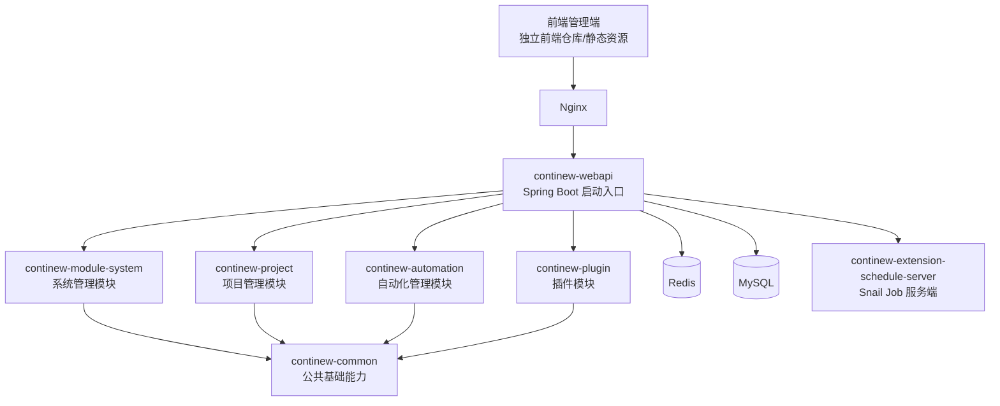
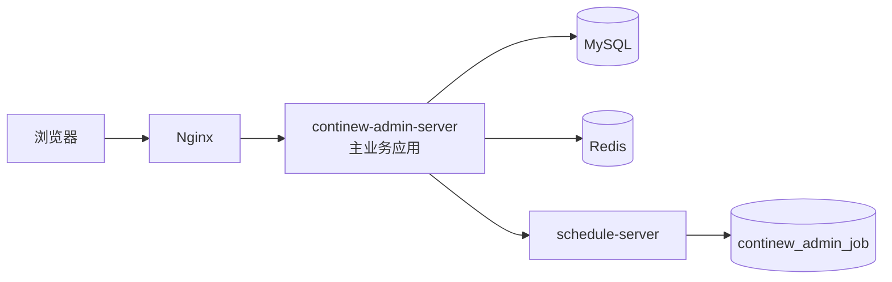

# SakurA Admin 项目架构说明

## 1. 文档目的

本文档用于对 `SakurA Admin` 项目进行系统化介绍，便于向领导、产品、测试和研发组员说明：

- 这个项目是什么
- 基于什么技术体系构建
- 当前代码仓库的模块边界和职责是什么
- 系统如何部署、如何启动、如何扩展
- 新成员接手后应从哪里开始进入正常开发

本文档基于两个信息源整理：

- 当前仓库真实代码结构与配置
- ContiNew 官方文档与公开资料

需要特别说明的是：

- 官方文档当前主站展示的是 `ContiNew Admin v4.0.0` 体系
- 当前仓库代码版本是 `3.6.0-SNAPSHOT`
- 因此，本文对“官方标准能力”的描述用于解释项目设计来源；凡是涉及“本仓库已落地内容”，均以当前仓库代码为准

## 2. 项目定位

`SakurA Admin` 是一个基于 `ContiNew Admin` 多模块后端体系二次演进出来的一站式开放自动化管理平台。

从当前仓库配置可以看出：

- 应用名为 `sakura-admin`
- 项目显示名为 `SakurA Admin`
- 基础包为 `top.continew.admin`
- 后端采用 `Spring Boot 3 + Java 17`
- 保留了 `ContiNew Admin` 的标准管理能力与插件化能力
- 在此基础上新增了更贴近企业内部场景的 `project` 与 `automation` 业务模块

可以把这个项目理解为两层结构：

1. 底层是 ContiNew Admin 提供的后台管理基础设施
2. 上层是你们团队围绕“项目管理 + 自动化配置 + UI 自动化场景管理”做的业务扩展

这意味着它既不是一个从零搭建的普通管理后台，也不是完全照搬官方脚手架，而是一个具备明确业务方向的企业内部平台。

## 3. 总体架构概览

### 3.1 架构分层

从代码结构看，项目采用典型的多模块分层架构：

- 接入与打包层：`continew-webapi`
- 系统基础业务层：`continew-module-system`
- 公共能力层：`continew-common`
- 插件层：`continew-plugin`
- 扩展服务层：`continew-extension`
- 自定义业务层：`continew-project`
- 自定义业务层：`continew-automation`

整体逻辑关系如下：

### 3.2 技术架构定位

项目本质上是一个“单体应用 + 模块化工程 + 外挂调度服务”的架构，而不是微服务拆分架构。

这样设计的优点是：

- 模块职责清晰，但部署仍然简单
- 适合中后台系统和内部平台场景
- 团队初期可以更快推进业务开发
- 便于复用统一认证、权限、日志、缓存、代码生成等公共能力

对管理层来说，这种架构的含义是：

- 成本可控
- 交付效率高
- 可在现阶段支撑中等复杂度的企业后台业务
- 后续若业务进一步扩大，也具备按模块拆分服务的基础

## 4. 技术栈说明

### 4.1 后端核心技术栈

结合仓库 `pom.xml`、应用配置以及 ContiNew 官方资料，当前项目核心技术栈如下：

| 类别 | 技术 | 说明 |
| --- | --- | --- |
| 运行时 | Java 17 | 当前项目编译与运行基线 |
| 应用框架 | Spring Boot 3.3.x | 后端主框架 |
| Web 容器 | Undertow | 替代 Tomcat，偏向高性能和轻量化 |
| 认证鉴权 | Sa-Token + JWT | 登录态、权限校验、会话控制 |
| ORM | MyBatis-Plus | 基础 CRUD、分页、条件构造 |
| CRUD 扩展 | ContiNew Starter CRUD | 快速生成通用增删改查接口 |
| 文档 | SpringDoc + Knife4j | OpenAPI 文档与调试界面 |
| 缓存 | JetCache + Redisson + Redis | 本地/分布式二级缓存 |
| 数据库 | MySQL 8 | 当前默认主数据库 |
| 数据库变更 | Liquibase | 数据结构版本管理，当前主应用 dev 环境默认关闭 |
| 文件存储 | X File Storage | 统一文件存储抽象 |
| 分布式 ID | CosId | 统一 ID 生成能力 |
| 调度中心 | Snail Job | 定时任务/重试任务服务端 |
| 代码生成 | FreeMarker + 代码生成插件 | 用于 CRUD 脚手架生成 |
| 链路日志 | TLog/Trace 能力 | 请求链路追踪 |
| Excel | EasyExcel 体系封装 | 数据导出 |
| 三方登录 | JustAuth | 第三方 OAuth 登录接入 |
| 短信 | SMS4J | 短信通道集成 |

### 4.2 前端技术栈

前端代码不在当前仓库中，但从官方 ContiNew Admin 资料可知，其标准前端体系为：

- Vue 3
- TypeScript
- Vite
- Arco Design

因此，对外介绍时应明确：

- 当前仓库主要是后端工程仓库
- 前端通常是独立仓库部署
- Nginx 在部署拓扑中承担静态资源托管与反向代理职责

## 5. 代码结构与模块职责

## 5.1 根工程

根工程是一个 Maven 聚合项目，负责：

- 统一版本号
- 统一依赖管理
- 统一构建插件
- 聚合各业务/插件/扩展模块

当前聚合模块包括：

- `continew-webapi`
- `continew-module-system`
- `continew-plugin`
- `continew-common`
- `continew-extension`
- `continew-project`
- `continew-automation`

## 5.2 continew-webapi

这是项目的启动与发布模块，也是整个系统的 API 暴露层。

核心职责：

- 提供 Spring Boot 启动入口
- 聚合系统模块、业务模块、插件模块
- 提供认证、通用接口、监控、系统接口等控制器
- 负责最终打包发布
- 负责资源复制、依赖打包、配置输出目录组织

它的特点是：

- 不是所有业务代码都写在这里
- 但所有能力最终都通过这个模块装配进运行时应用
- 打包结果采用 `bin + config + lib` 的应用目录形式，便于运维部署

本模块当前包含的典型控制器包括：

- 认证：`AuthController`
- 通用能力：`CaptchaController`、`CommonController`、`DashboardController`
- 系统监控：`OnlineUserController`
- 系统管理：用户、角色、菜单、字典、文件、通知、日志等控制器
- 插件能力：代码生成、开放平台、任务调度控制器

## 5.3 continew-module-system

这是标准系统管理模块，属于后台平台的基础业务层。

核心职责：

- 用户管理
- 角色管理
- 菜单与按钮权限管理
- 部门组织管理
- 字典管理
- 系统配置
- 通知公告
- 文件管理
- 消息中心
- 客户端/应用接入等基础管理能力

这一层的价值在于：

- 为所有上层业务模块提供统一的账号、权限和组织能力
- 避免每个业务模块重复实现 RBAC、菜单、日志、配置等通用基础设施

对团队开发而言，这一层一般是“平台底座”，改动应谨慎，优先复用，不建议轻易破坏其通用性。

## 5.4 continew-common

这是整个项目最关键的公共能力模块，承担“横切能力沉淀”职责。

从当前目录可以看出，该模块主要包含：

- `config`：全局配置与框架集成
- `constant`：常量定义
- `context`：上下文封装
- `controller`：公共控制器基类
- `core`：基础核心工具
- `date`：日期处理
- `db`：数据库工具与多库接入辅助
- `enums`：公共枚举
- `jenkins`：Jenkins 接口封装
- `json`：JSON 工具
- `model`：公共实体/模型
- `regex`：正则工具
- `service`：公共服务封装
- `sort`：排序工具
- `ssh`：SSH/SFTP 工具
- `util`：通用工具
- `uuid`：ID/UUID 工具

当前已明确存在的重要基础能力包括：

- 全局异常处理
- Sa-Token 异常处理
- MyBatis Plus 配置
- 自动填充创建/修改人和时间
- 数据权限支持类
- WebSocket 客户端服务
- Excel 字典转换能力
- 基础实体 `BaseDO`

这意味着 `continew-common` 不是简单的工具包，而是平台框架层的一部分。后续新增通用组件时，优先评估是否应下沉到这一层。

## 5.5 continew-plugin

这是插件聚合模块，当前包含 3 个子模块：

- `continew-plugin-schedule`
- `continew-plugin-open`
- `continew-plugin-generator`

### 5.5.1 continew-plugin-schedule

负责任务调度能力接入，面向后台提供：

- 任务管理
- 任务日志
- 调度相关接口

该模块与 `Snail Job` 服务端能力联动，是定时任务与重试任务体系的重要组成部分。

### 5.5.2 continew-plugin-open

负责开放平台能力，通常用于：

- 应用 AK/SK 管理
- 开放接口鉴权
- 外部系统接入
- 签名校验与开放接口协议封装

如果未来要做系统集成、第三方对接、开放 API 网关式能力，这一模块会是核心基础。

### 5.5.3 continew-plugin-generator

负责代码生成能力，主要基于数据库表结构与模板生成前后端代码骨架。

价值在于：

- 降低重复性 CRUD 开发成本
- 统一代码风格
- 缩短新模块交付周期

对于内部平台项目，这是提升研发人效的重要模块。

## 5.6 continew-extension

这是扩展服务聚合模块，当前包含：

- `continew-extension-schedule-server`

它不是主业务 API 的一部分，而是独立扩展服务。

## 5.7 continew-extension-schedule-server

该模块是 `Snail Job` 调度服务端，对应独立端口和独立数据库。

从当前配置可知：

- 默认服务端口：`8001`
- Netty 端口：`1788`
- 默认数据库：`continew_admin_job`
- dev 环境下 Liquibase 默认开启

该模块的职责是：

- 承担调度中心服务端角色
- 管理任务调度、重试、日志等能力
- 与主应用通过配置联动

这说明项目虽然主体是单体应用，但在任务调度上已经做了服务外置，这是一种比较实用的“局部解耦”。

## 5.8 continew-project

这是当前仓库新增的核心业务模块之一，明显不是官方原版最初的基础系统模块，而是面向你们业务场景的项目管理域。

当前控制器显示，该模块至少包含以下能力：

- 项目配置管理 `ProjectConfig`
- 项目数据库配置管理 `ProjectDataBaseConfig`
- 项目环境配置管理 `ProjectEnvironmentConfig`
- 项目服务器配置管理 `ProjectServerConfig`
- 项目版本配置管理 `ProjectVersionConfig`
- 项目模块配置管理 `ProjectModuleConfig`

从接口设计和命名上看，这一模块承担的是“项目主数据中心”职责，主要作用是：

- 维护项目基础信息
- 维护项目与环境、服务器、数据库、版本之间的映射关系
- 为自动化模块提供项目维度的主数据支撑
- 支持树形模块结构和拖拽排序

这层可以理解为：

- 自动化平台的业务主数据层
- 后续所有自动化、发布、测试、资产管理能力的基础

如果未来做持续交付、环境编排、自动化测试编排，这一层会持续扩展。

## 5.9 continew-automation

这是当前仓库新增的另一个核心业务模块，重点承载自动化管理能力。

当前已出现的控制器和对象表明，该模块至少包含：

- 自动化项目配置
- 自动化环境配置
- 自动化 Jenkins 配置
- 自动化节点配置
- 自动化浏览器配置
- UI 自动化场景配置

其中 `AutomationUiSceneController` 已经不仅仅是基础 CRUD，而是开始进入业务编排阶段，支持：

- 场景树查询
- 用例增删改拖拽
- 步骤增删改拖拽

这说明自动化模块已经从“配置管理”走向“场景建模”，具备继续演进为测试自动化平台的潜力。

从当前代码推断，这个模块大概率承担以下业务目标：

- 维护自动化执行所需的环境与执行资源
- 维护 Jenkins、节点、浏览器等执行基础设施
- 组织 UI 自动化场景、用例、步骤
- 与项目模块联动，为不同项目/版本提供自动化资产管理能力

这也是当前仓库最值得对外重点介绍的差异化业务价值。

## 6. 运行时架构

## 6.1 启动方式

主应用启动入口位于：

- `continew-webapi/src/main/java/top/continew/admin/ContiNewAdminApplication.java`

启动类上启用了以下关键能力：

- 文件存储能力
- 方法级缓存
- 全局响应封装
- CRUD 控制器扩展
- OpenFeign
- MyBatis Mapper 扫描

这意味着主应用在启动后会一次性装配：

- 系统基础模块
- 自定义业务模块
- 插件模块
- 通用基础能力

## 6.2 配置体系

当前主应用配置采用多环境 YAML 组织：

- `application.yml`
- `application-dev.yml`
- `application-prod.yml`
- `application-generator.yml`

主要特点如下：

- 默认激活环境为 `dev`
- 默认端口为 `8000`
- 数据库与 Redis 通过环境变量可覆盖
- 系统开启统一响应封装
- 认证采用 Sa-Token + JWT + Redis 持久化
- 开发环境开启 Swagger/Knife4j
- 支持 WebSocket
- 支持本地与分布式二级缓存

## 6.3 数据存储

### 主业务库

主应用默认连接数据库：

- `continew_admin`

其作用包括：

- 系统管理数据
- 业务主数据
- 自动化配置数据
- 插件业务数据

### 调度库

扩展调度服务默认连接数据库：

- `continew_admin_job`

其作用包括：

- 调度中心任务数据
- 调度日志
- 重试/执行记录等

### 缓存

Redis 用于：

- 登录态持久化
- 分布式缓存
- 二级缓存远程层
- 验证码与行为校验缓存
- 可能的分布式协调与锁

## 7. 安全与权限设计

从官方体系和当前代码配置看，项目安全设计主要包含以下几个层面：

- Sa-Token 登录认证
- 基于权限码的接口鉴权
- JWT 支持
- Redis 持久化会话
- 行为验证码与图形验证码
- 全局异常与统一响应封装
- 字段加解密支持
- 密码编码器
- 数据权限支持类

当前控制器大量使用 `@SaCheckPermission`，说明权限控制模型以“细粒度权限点”方式落地，适合后台管理系统。

这类设计的好处是：

- 菜单权限和接口权限较容易统一
- 前后端都可以基于权限码做能力控制
- 有利于后续按角色、部门、数据范围继续扩展

## 8. 部署架构

仓库内已提供 `docker/docker-compose.yml`，说明项目已经具备标准容器化部署思路。

当前部署拓扑如下：

部署组件包括：

- `mysql`
- `redis`
- `continew-admin-server`
- `schedule-server`
- `nginx`

这套部署方案的意义是：

- 本地开发、测试环境、演示环境都可以快速拉起
- 主应用与调度服务职责分离
- Nginx 能同时代理前端页面与后端接口

## 9. 典型请求链路

以“项目配置管理”或“自动化场景管理”为例，请求链路大致如下：

1. 前端页面通过 Nginx 访问后端接口
2. 请求进入 `continew-webapi` 中暴露的控制器
3. 经过认证、权限、统一响应、异常处理等通用拦截
4. 控制器调用具体业务模块 Service
5. Service 调用 Mapper 访问 MySQL
6. 必要时通过 Redis 完成缓存/状态共享
7. 若涉及调度任务，则进一步调用调度插件或调度服务端

对应到研发协作上，典型开发路径就是：

- Controller 放在接入模块或业务模块公开接口层
- Service 放在业务模块内部
- 通用能力尽量下沉到 `continew-common`
- 调度与开放能力优先复用插件层

## 10. 当前项目的业务亮点

站在汇报和介绍角度，这个项目的亮点不应只讲“用了什么框架”，而应讲“平台能力 + 业务价值”。

建议对外重点突出以下几点：

### 10.1 平台底座成熟

项目并非从零搭建，而是站在 ContiNew Admin 成熟底座之上，天然具备：

- 用户、角色、菜单、部门、字典等基础后台能力
- 统一认证与权限控制
- 统一日志、统一响应、统一异常处理
- 文件管理、通知公告、消息中心等通用能力

这意味着研发资源可以集中投入业务，而不是反复建设基础设施。

### 10.2 具备明显业务域扩展

当前仓库已经沉淀出两个很明确的业务方向：

- 项目主数据管理
- 自动化资产与执行配置管理

这说明项目不是单纯管理后台，而是面向内部工程效率和自动化协同的平台。

### 10.3 自动化平台雏形已经形成

自动化模块已经覆盖：

- 项目
- 环境
- 浏览器
- 节点
- Jenkins
- UI 场景/用例/步骤

这意味着系统具备往下继续打造成“自动化测试与执行管理平台”的基础。

### 10.4 插件化和扩展能力较强

通过 `plugin` 与 `extension` 两层设计，项目已经体现出较好的可扩展性：

- 可继续增加独立插件
- 可继续增加外围扩展服务
- 不必把所有能力都塞进主业务模块

## 11. 当前架构的优点与风险

## 11.1 优点

- 多模块拆分清晰，便于团队分工
- 保留单体部署效率，交付成本低
- 平台基础能力完整，重复建设少
- 业务模块与通用模块边界相对明确
- 具备插件和扩展服务的演进空间
- 适合当前“快速建设内部平台”的阶段

## 11.2 风险与注意点

- 官方文档版本与仓库代码版本不完全一致，培训时必须区分“官方能力”与“本仓库已落地能力”
- 当前仓库已有较多未提交改动，说明业务仍在快速演进，文档需要跟随版本持续维护
- 部分配置中存在开发环境默认账号、密码、密钥示例，正式环境必须收敛到安全配置中心或环境变量
- `continew-common` 承载内容较多，若后续继续膨胀，可能演变为“万能公共模块”
- 自动化业务模型正在快速扩展，若缺少统一领域建模规范，后续容易出现字段和接口语义漂移

## 12. 团队开发建议

为了让项目顺利进入持续开发阶段，建议按下面方式组织协作。

### 12.1 模块责任建议

- 平台组负责：`continew-webapi`、`continew-module-system`、`continew-common`
- 业务组负责：`continew-project`、`continew-automation`
- 架构/基础设施组负责：`continew-plugin`、`continew-extension`、部署脚本

### 12.2 新功能落点建议

- 通用配置、异常、权限、公共组件：优先放 `continew-common`
- 系统账号、菜单、角色、通知等平台功能：放 `continew-module-system`
- 项目主数据能力：放 `continew-project`
- 自动化场景、资源、执行相关能力：放 `continew-automation`
- 通用开放能力、调度能力、代码生成能力：优先复用或扩展 `continew-plugin`
- 独立服务形态能力：考虑落 `continew-extension`

### 12.3 开发规范建议

- 尽量复用现有 CRUD 扩展，不重复造基础接口模板
- 所有权限点命名统一归口管理
- 数据库变更优先走 Liquibase 或标准 SQL 版本化流程
- 新增业务字段时同步考虑导出、字典转换、权限控制和审计字段
- 新成员优先从 `ProjectConfig` 和 `AutomationUiScene` 两条链路熟悉代码

## 13. 新成员接手建议

对于后续要进入正常开发的组员，建议按以下顺序熟悉项目：

1. 先看根 `pom.xml`，理解模块结构
2. 再看 `continew-webapi` 启动类和配置文件，理解应用怎么跑起来
3. 再看 `continew-module-system`，理解权限、菜单、用户等底座能力
4. 再看 `continew-common`，理解公共基类、配置、异常、MyBatis 扩展
5. 然后重点熟悉 `continew-project`
6. 最后再进入 `continew-automation`，理解自动化业务模型

如果是给新研发做入项培训，推荐按下面顺序讲解：

1. 项目定位与业务目标
2. 总体模块图
3. 技术栈与部署图
4. 项目管理模块
5. 自动化管理模块
6. 权限、安全、调度与插件机制
7. 开发协作规则

## 14. 后续演进建议

基于当前架构，后续可以沿以下方向演进：

- 完善项目域模型，打通项目、环境、服务器、数据库、版本、模块之间的完整关系
- 继续深化自动化场景模型，形成可执行的测试资产体系
- 将 Jenkins、节点、浏览器等能力进一步标准化为资源中心
- 建立统一执行记录、报告、日志追踪链路
- 逐步补齐架构图、ER 图、接口分组图、部署手册、开发手册
- 如果业务复杂度进一步上升，可按业务域拆分独立服务

## 15. 总结

`SakurA Admin` 当前已经具备比较清晰的平台化轮廓：

- 底层基于 ContiNew Admin，具备成熟后台基础设施
- 中层通过 common/system/plugin/extension 形成可复用平台能力
- 上层通过 `project` 与 `automation` 两个业务模块体现真实业务价值

从管理角度看，这个项目已经不只是“一个管理后台”，而是一个面向项目管理与自动化协同的内部平台雏形。

从研发角度看，当前最重要的事情不是继续堆功能，而是：

- 稳定模块边界
- 统一领域建模
- 规范开发入口
- 让新成员能够快速、低成本进入正常开发

只要后续围绕这四点持续推进，这个项目可以比较自然地演进为团队内部的核心工程效率平台。

## 16. 参考资料

- ContiNew 官方站点：https://continew.top
- ContiNew Admin 项目介绍：https://continew.top/admin/guide/introduction.html
- ContiNew Admin 后端项目结构：https://continew.top/docs/admin/backend/structure.html
- ContiNew Admin 认证鉴权说明：https://continew.top/docs/admin/backend/auth.html
- ContiNew Admin 数据权限说明：https://continew.top/docs/admin/backend/data-permission.html

## 17. 本文档对应仓库信息

- 仓库名称：`sakura-admin`
- 当前分析时间：`2026-04-20`
- 当前识别版本：`3.6.0-SNAPSHOT`
- 当前文档性质：基于代码现状和官方资料整理的架构说明稿
